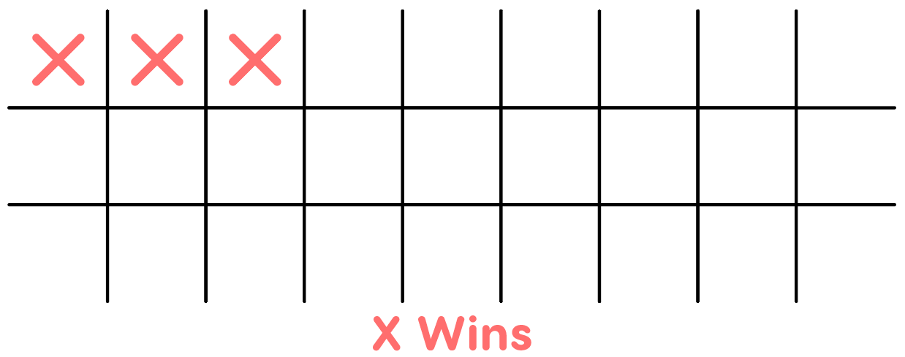
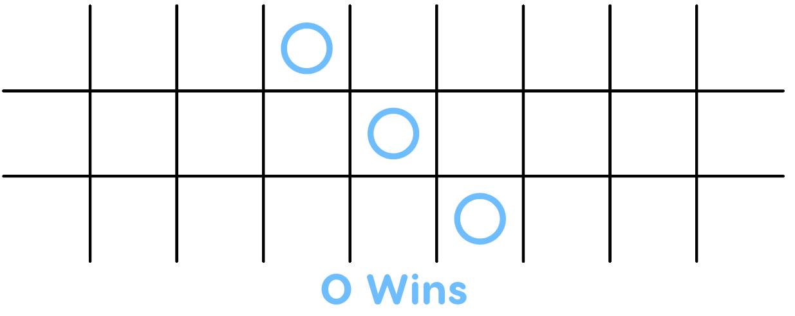
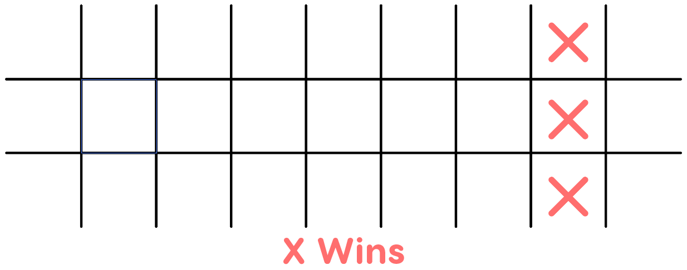
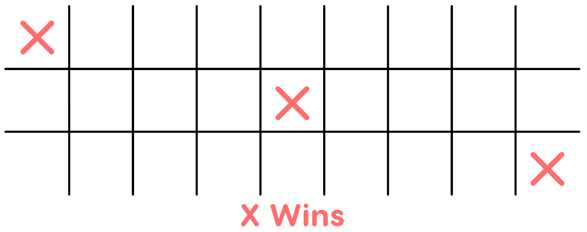
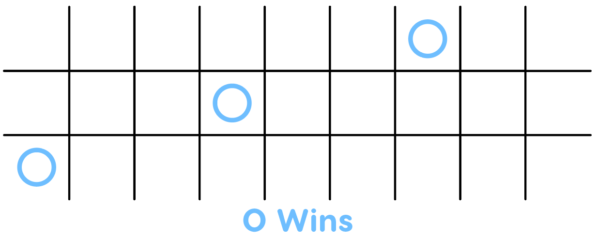
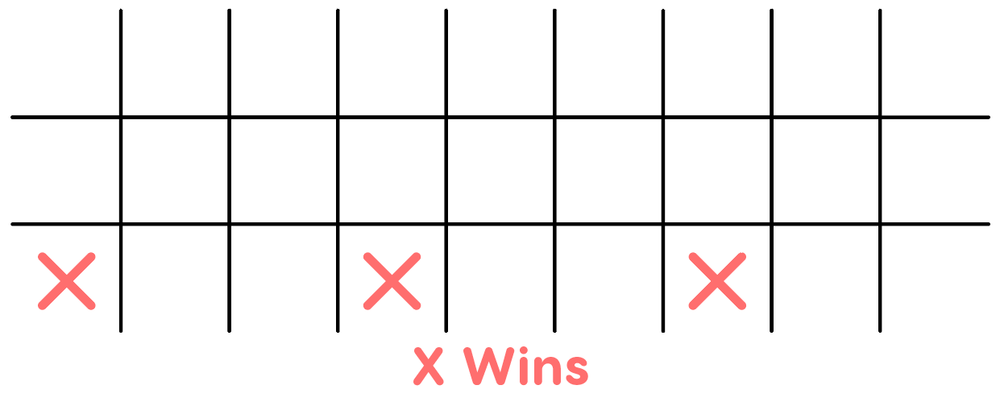
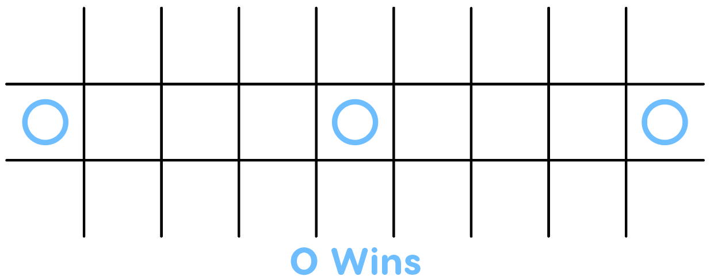
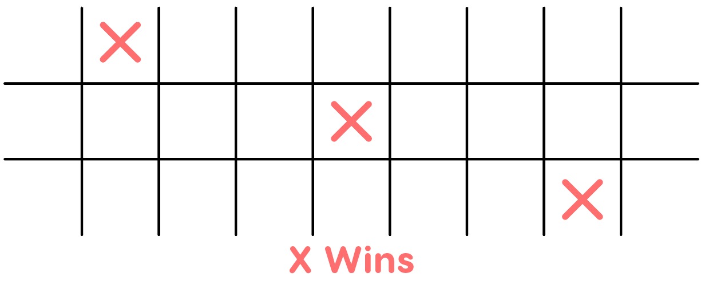

# 3D Tic Tac Toe
## Introduction
Everyone know what Tic Tac Toe is, so much so, it's pretty much impossible to win. This is a variant of Tic Tac Toe created by me and a friend of mine to attempt to spruce things up.

## Rules
1. At the beginning of the game, each player gets to block a cell. This obviously restricts certain wining combinations and is used to balance the power of the starting move and create varaiation between every match
2. Tic Tac Toe proceeds as usual, players alternate to mark cells until one person declares a win

### What on earth is declaring a win?
As the title says, in order to win, you must declare that you have done so. But there are certain caveats:
1. You must declare a win either before your opponent marks their next cell. Once your opponent has marked their cell, any valid winning combination is void. You can even declare a win before marking your next cell, but...
2. If you incorrectly declare a win, **your opponent wins**

## How do I know I have won?
Split the board into three smaller tic-tac-toe boards. Firstly, a winning condition can arise when a winning conditions for classic tic-tac-toe arises on these smaller boards:

Here is where the game gets interesting. Imagine now, the three grids stacked on top of each other, with the left 3x3 as the top grid. Winning conditions arise from being able to draw a straight or 45 degree line (from the x, y, or z axis) through your marked cells. The following are all win conditions, try to visualize them.

